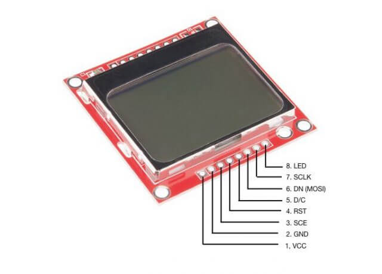

# NOKIA-display-interface
Nokia display interface using PIC16F877A microcontroller

## Development environment
Microcontroller : Microchip PIC16F877A
IDE used        : MPLab v8.36 with HIGH-TECH compiler
Display         : PCD8544 48x84 pixels

